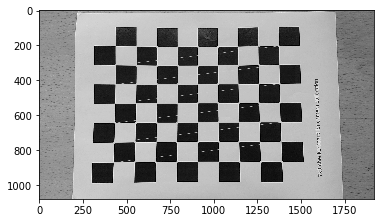

# Robotics 
Collection of Python implementations of Robotics and Computer Vision theories taught in 
1. University of Pennsylvania [Robotics Specialization](https://www.coursera.org/specializations/robotics?) 
2. University of Cambridge [Computer Vision](https://www.cl.cam.ac.uk/teaching/1617/E4F12/)
3. University of Cambridge Robotics
4. University of Cambridge [Reinforcement Learning and Decision Making](http://mlg.eng.cam.ac.uk/teaching/mlsalt7/1516/)

Aims of this repo are to rewrite all MATLAB demos from the online courses into Python to develop a deeper understanding about those Robotics and Computer Vision concepts, and provide more readable scripts for beginners to begin their learning about Robotics. [**Mobility course is coming soon!]

## Configuration
+ Python 3.7.4
+ numpy 1.16.5
+ scipy 1.3.1
+ matplotlib 3.1.1
+ yaml 5.1.2
+ open-cv 3.4.2
+ glob 0.7
+ tqdm 4.36.1
+ sympy 1.4
+ slycot 0.3.5.0

## Table of Contents
+ [Quadcopter 1D](Aerial%20Robotics/Quadcopter1D.ipynb)
+ [Quadcopter 2D](Aerial%20Robotics/Quadcopter2D.ipynb) 
+ [Dijkstra Algorithm](Computational%20Motion%20Planning/DijkstraGrid/DijkstraAlgorithm.ipynb)
+ [A-star Algorithm](Computational%20Motion%20Planning/Astar/AstarAlgorithm.ipynb)
+ [Configuration Space](Computational%20Motion%20Planning/ConfigurationSpace/ConfigurationSpace.ipynb)
+ [Potential Field Path](Computational%20Motion%20Planning/PotentialFieldPlanPath/PotentialFieldPath.ipynb)
+ [2D Homography](Perception/Logo%20Projection/LogoProjection.ipynb)
+ [3D Homography](Perception/3D%20object%20projection/3D%20Homography.ipynb)
+ [Optical Track](Perception/Optical%20Track/CornerTracking.ipynb)
+ [Point Cloud](Perception/Point%20Cloud/PointCloud.ipynb)
+ [Calibration](Perception/Calibration/calibrationviaChessBoard.ipynb)
+ [Kalman Filter](Estimation%20and%20Learning/Kalman%20Filter/BallPathPrediction_KalmanFilter.ipynb)
+ [Occupancy Grid Map](Estimation%20and%20Learning/Occupancy%20Grid%20Map/occGridMapping.ipynb)
+ [Particle Localization](Estimation%20and%20Learning/Particle%20Localization/ParticleLocalization.ipynb)
+ [Proportional-Derivative Control](Capstone/PD%20control/PDTrack.ipynb)
+ [Proportional-Derivative Track Arm](Capstone/PD%20control/ManipTrack.ipynb)
+ [Solve Ordinary Differential Equation](Capstone/ODE%20solver/Ordinary%20Differential%20Equation.ipynb)
+ [Estimated Kalman Filter](Capstone/Estimated%20Kalman%20Filter/EKF.ipynb)
+ [Mobile Inverted Pendulum](Capstone/Mobile%20Inverted%20Pendulum/MIP.ipynb)
+ [Linear–quadratic regulator Mobile Inverted Pendulum](Capstone/LQR%20MIP/LQRMIP.ipynb)
+ [Proportional–Integral–Derivative controller Mobile Inverted Pendulum](Capstone/PID%20MIP/PIDControlMIP.ipynb)
+ [Value Iteration](Reinforcemnet%20Learning/ValueIteration.ipynb)
+ [Policy Iteration](Reinforcemnet%20Learning/PolicyIteration.ipynb)
+ [State–Action–Reward–State–Action](Reinforcemnet%20Learning/sarsa.ipynb)
+ [Q-Learning](Reinforcemnet%20Learning/q-learning.ipynb)
+ [Suceptible-Infectious-Removed](simWUCOV.py)

## Outputs
[Quadcopter 1D](Aerial%20Robotics/Quadcopter1D.ipynb) | [Quadcopter 2D](Aerial%20Robotics/Quadcopter2D.ipynb) |[Dijkstra Algorithm](Computational%20Motion%20Planning/DijkstraGrid/DijkstraAlgorithm.ipynb)|[A-star Algorithm](Computational%20Motion%20Planning/Astar/AstarAlgorithm.ipynb)
:-------------------------:|:-------------------------:|:--:|:--:
|||
[Configuration Space](Computational%20Motion%20Planning/ConfigurationSpace/ConfigurationSpace.ipynb)|[Potential Field Path](Computational%20Motion%20Planning/PotentialFieldPlanPath/PotentialFieldPath.ipynb)|[2D Homography](Perception/Logo%20Projection/LogoProjection.ipynb)|[3D Homography](Perception/3D%20object%20projection/3D%20Homography.ipynb)
|||
[Optical Track](Perception/Optical%20Track/CornerTracking.ipynb)|[Point Cloud](Perception/Point%20Cloud/PointCloud.ipynb)|[Calibration](Perception/Calibration/calibrationviaChessBoard.ipynb)|[Kalman Filter](Estimation%20and%20Learning/Kalman%20Filter/BallPathPrediction_KalmanFilter.ipynb)
|||
[Occupancy Grid Map](Estimation%20and%20Learning/Occupancy%20Grid%20Map/occGridMapping.ipynb)|[Particle Localization](Estimation%20and%20Learning/Particle%20Localization/ParticleLocalization.ipynb)|[PD Control](Capstone/PD%20control/PDTrack.ipynb)|[PD Track Arm](Capstone/PD%20control/ManipTrack.ipynb)
|||
[Solve ODE](Capstone/ODE%20solver/Ordinary%20Differential%20Equation.ipynb)|[Estimated Kalman Filter](Capstone/Estimated%20Kalman%20Filter/EKF.ipynb)|[Mobile Inverted Pendulum](Capstone/Mobile%20Inverted%20Pendulum/MIP.ipynb)|[LQR MIP](Capstone/LQR%20MIP/LQRMIP.ipynb)
|||
[PID MIP](Capstone/PID%20MIP/PIDControlMIP.ipynb)|[Value Iteration](Reinforcemnet%20Learning/ValueIteration.ipynb)|[sarsa](Reinforcemnet%20Learning/sarsa.ipynb)|[Q-Learning](Reinforcemnet%20Learning/q-learning.ipynb)
|||
[SIR model](simWUCOV.py)|||
|||
